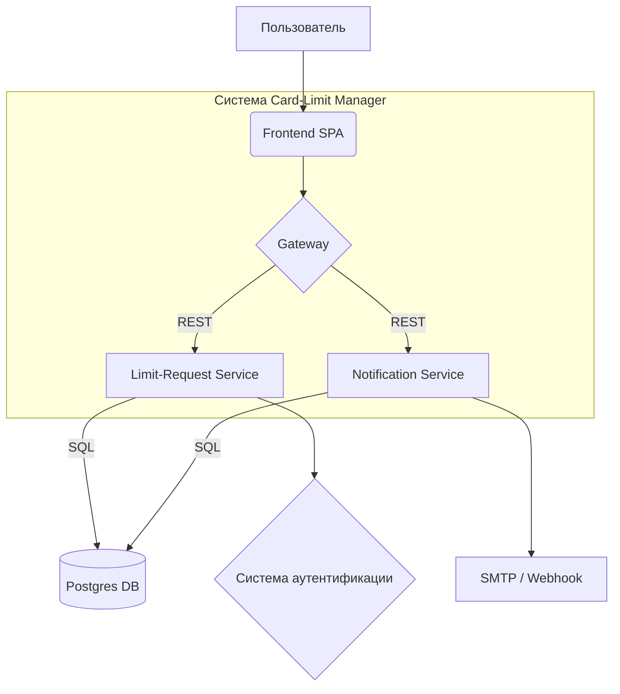

# Архитектура проекта "Card Limit Manager"

## Общее описание

Система "Card Limit Manager" предназначена для автоматизации процесса подачи и согласования заявок на изменение лимитов корпоративных банковских карт. Архитектура системы построена на основе микросервисного подхода с использованием современных технологий и практик.

## Компоненты системы

### 1. Frontend (SPA)

- **Технологии:** React 18, TypeScript, Vite
- **Описание:** Одностраничное приложение, предоставляющее пользовательский интерфейс для взаимодействия с системой. Включает формы для создания заявок, списки заявок, дашборд для отслеживания статусов.

### 2. Gateway

- **Описание:** Точка входа для всех клиентских запросов. Отвечает за HTTPS, аутентификацию (проверка JWT), ограничение частоты запросов (rate-limiting). Направляет запросы к соответствующим бэкенд-сервисам.

### 3. Limit-Request Service (CLM)

- **Технологии:** Go 1.22, Gin
- **Описание:** Основной бэкенд-сервис, реализующий бизнес-логику управления заявками. Предоставляет REST API для CRUD-операций с заявками и управления их жизненным циклом (согласование, отклонение).
- **API эндпоинты (согласно R-9):**
  - `POST /requests` - создание новой заявки
  - `GET /requests` - получение списка заявок (с учетом прав доступа)
  - `GET /requests/{id}` - получение информации о конкретной заявке
  - `PATCH /requests/{id}/approve` - утверждение заявки
  - `PATCH /requests/{id}/reject` - отклонение заявки

### 4. Notification Service (NOTIF)

- **Технологии:** Go 1.22
- **Описание:** Отвечает за асинхронную отправку уведомлений пользователям. Поддерживает отправку email-уведомлений (через локальный SMTP-stub для разработки) и потенциально web-hooks о событиях в системе, таких как изменение статуса заявки (R-6).

### 5. База данных

- **Технологии:** Postgres 16
- **Описание:** Реляционная СУБД, используемая для хранения всех данных приложения, включая информацию о заявках, пользователях, и аудит-логах (R-10). Миграции схемы управляются с помощью `sql-migrate`. Уровень изоляции транзакций: `READ COMMITTED` (Нефункциональное требование A).

### 6. Система аутентификации и авторизации

- **Технологии:** Keycloak (или аналогичный OIDC-провайдер)
- **Описание:** Внешний сервис, отвечающий за аутентификацию пользователей и выпуск JWT-токенов. Ролевая модель (R-8) реализуется на основе информации из токенов.

## Диаграмма компонентов



## Взаимодействие компонентов (Workflow согласования заявки)

1.  **Инициатор** (сотрудник) через **Frontend SPA** создает заявку (R-1). Запрос проходит через **Gateway**.
2.  **Gateway** аутентифицирует пользователя (через OIDC провайдера) и направляет запрос на **Limit-Request Service (CLM)**.
3.  **CLM** сохраняет заявку в **Postgres DB** и, согласно R-2, назначает первого согласующего (Team Lead).
4.  **CLM** инициирует отправку уведомления через **Notification Service (NOTIF)**.
5.  **NOTIF** отправляет email-уведомление Team Lead (R-6).
6.  **Team Lead** через **Frontend SPA** утверждает или отклоняет заявку (R-3).
7.  **CLM** обновляет статус заявки в **Postgres DB**.
8.  Если сумма заявки > 1,000,000 RUB и заявка утверждена Team Lead, следующим согласующим назначается CFO (R-4). В противном случае (или после CFO), если не отклонено, заявка уходит Risk Officer (R-4).
9.  Процесс повторяется для каждого уровня согласования. Каждый шаг фиксируется (R-5), и отправляются уведомления (R-6).
10. Заявка переходит в статус "Completed" после финального утверждения или "Rejected" после любого отклонения (R-7).
11. Все изменения состояний и действия пользователей логируются в Audit Log в **Postgres DB** (R-10).

## Нефункциональные аспекты

- **Производительность:** Система должна обрабатывать не менее 50 rps с временем отклика 95-го перцентиля <= 150 мс (согласно `project_overview.md`, для API - 100rps, 500ms согласно R-B). API должен выдерживать пиковую нагрузку 100 rps с максимальным временем отклика 500 мс (Нефункциональное требование B). Система должна поддерживать 500 активных пользователей (Нефункциональное требование C).
- **Безопасность:** Обязательная проверка JWT на Gateway, аудит-лог всех изменений (R-10).
- **Тестируемость:** Unit-тесты с покрытием >= 80% (Go, React), интеграционные тесты, e2e-тесты Playwright (Нефункциональное требование E).
- **Развертывание:** Все компоненты упакованы в Docker и запускаются через `docker-compose up` (Нефункциональное требование D).
- **Логирование:** Логи в stdout в формате JSON (GCP-style), уровень не ниже INFO (Нефункциональное требование F).
- **Расширяемость:** Архитектура должна позволять легко добавлять новые роли и этапы в процесс согласования (Нефункциональное требование G).

---

## 🚀 Текущее состояние реализации (MVP)

### Реализованные компоненты

#### Frontend (React + TypeScript) ✅

- **Статус:** Полностью реализован
- **Функции:**
  - Форма создания заявки на повышение лимита
  - Валидация пользовательского ввода
  - Отправка данных в backend API
  - Отображение результатов операций
- **Порт:** 3000 (внутри контейнера)

#### Nginx Proxy ✅ (временная замена Gateway)

- **Статус:** Реализован как временное решение
- **Функции:**
  - Роутинг запросов между frontend и backend
  - Статическая раздача файлов frontend
  - Health check эндпоинт
- **Порт:** 80 (внешний доступ)
- **Планы:** Заменить на полноценный Gateway с JWT аутентификацией

#### CLM Service (Go + Gin) ✅

- **Статус:** Частично реализован
- **Реализованные функции:**
  - `POST /api/v1/requests` - создание новой заявки
  - Валидация бизнес-логики
  - Сохранение данных в PostgreSQL
- **Планируемые функции:**
  - `GET /requests` - получение списка заявок
  - `GET /requests/{id}` - получение конкретной заявки
  - `PATCH /requests/{id}/approve` - утверждение заявки
  - `PATCH /requests/{id}/reject` - отклонение заявки
- **Порт:** 8080 (внутри контейнера)

#### PostgreSQL Database ✅

- **Статус:** Полностью реализован
- **Функции:**
  - Хранение пользователей и заявок
  - Автоматические миграции при запуске
  - Тестовые данные (4 пользователя с разными ролями)
- **Схема:** Соответствует `docs/database.dbml`
- **Порт:** 5432

### Нереализованные компоненты

#### Gateway ❌

- **Статус:** Не реализован
- **Временная замена:** Nginx Proxy
- **Планы:** Реализация с JWT аутентификацией, rate limiting, HTTPS

#### Notification Service (NOTIF) ❌

- **Статус:** Не реализован
- **Планы:** Асинхронные email уведомления, web-hooks

#### Система аутентификации ❌

- **Статус:** Не реализован
- **Временное решение:** Фиксированный пользователь для демонстрации
- **Планы:** Интеграция с Keycloak или аналогичным OIDC провайдером

### 👥 Тестовые пользователи

При запуске автоматически создаются тестовые пользователи:

| Роль             | Имя               | Email                | ID                                     |
| ---------------- | ----------------- | -------------------- | -------------------------------------- |
| **EMPLOYEE**     | Test User         | test@example.com     | `a005d32d-6190-477c-b23e-38c44eaaaae0` |
| **TEAM_LEAD**    | Team Lead User    | teamlead@example.com | `b123e567-e89b-12d3-a456-426614174000` |
| **RISK_OFFICER** | Risk Officer User | risk@example.com     | `c789f012-e89b-12d3-a456-426614174001` |
| **CFO**          | CFO User          | cfo@example.com      | `d456c789-e89b-12d3-a456-426614174002` |

### 🌐 Текущие API Endpoints

#### POST /api/v1/requests ✅

Создание новой заявки на повышение лимита.

**Request:**

```json
{
  "amount": 1000.0,
  "currency": "USD",
  "justification": "Business trip to conference",
  "desired_date": "2024-12-31"
}
```

**Response (201):**

```json
{
  "id": "fa401de5-aaa1-49ec-bcb1-78e5a7fc243f",
  "user_id": "a005d32d-6190-477c-b23e-38c44eaaaae0",
  "amount": 1000,
  "currency": "USD",
  "justification": "Business trip to conference",
  "desired_date": "2024-12-31",
  "status": "PENDING_TEAM_LEAD",
  "created_at": "2025-05-23T07:24:23.337009Z",
  "updated_at": "2025-05-23T07:24:23.337009Z"
}
```

### 🚀 Развертывание MVP

#### Docker Compose ✅

Система полностью контейнеризована и запускается одной командой:

```bash
docker compose up
```

#### Порядок запуска ✅

1. PostgreSQL (база данных)
2. Migrator (применение миграций)
3. CLM Service (backend API)
4. Frontend (React приложение)
5. Nginx Proxy (роутинг)

### 🔮 Планы развития

1. **Завершение CLM Service**

   - Реализация всех API эндпоинтов (R-9)
   - Workflow согласования (R-2, R-3, R-4)
   - Аудит-лог (R-10)

2. **Gateway с аутентификацией**

   - JWT токены
   - Rate limiting
   - HTTPS/TLS

3. **Notification Service**

   - Email уведомления (R-6)
   - Web-hooks
   - Интеграция с внешними системами

4. **Расширение Frontend**
   - Dashboard для аппруверов
   - История заявок
   - Ролевая модель (R-8)
