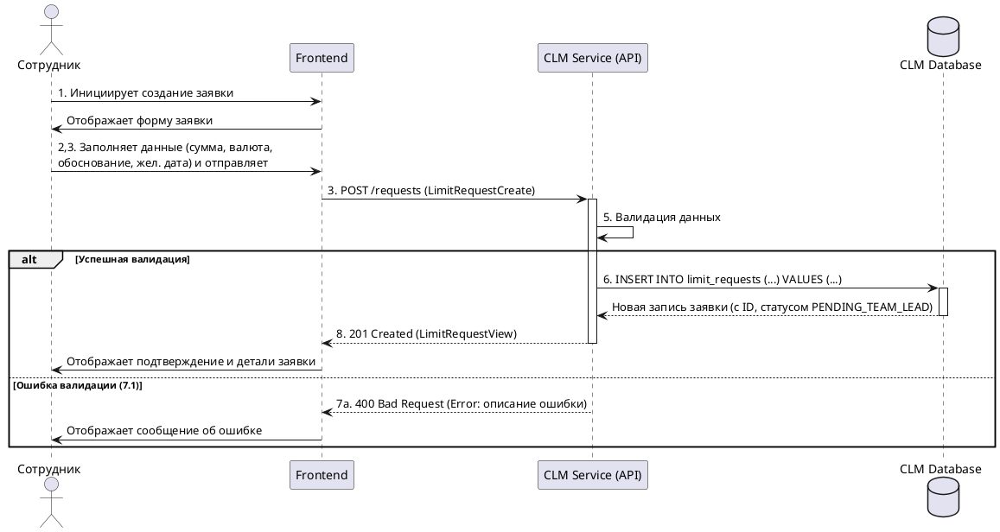

# Спецификация: R-1 Создание заявки на изменение лимита

## 1. Обзор

Данный документ описывает процесс и требования к созданию новой заявки на изменение лимита карты сотрудником.

## 2. Ссылка на требование

- **R-1**: Сотрудник создаёт заявку: сумма, валюта, обоснование, желаемая дата начала. (из `docs/requirements.md`)

## 3. Заинтересованные стороны

- **Сотрудник**: Инициатор заявки.
- **Система**: Платформа Card Limit Manager.

## 4. Предусловия

- Сотрудник аутентифицирован в системе.
- Сотрудник имеет роль `employee`.

## 5. Постусловия

- **Успех**:
  - Новая заявка успешно создана в системе.
  - Заявке присвоен уникальный идентификатор.
  - Начальный статус заявки установлен в `PENDING_TEAM_LEAD` (согласно логике R-2, хотя это требование отдельно).
  - Данные заявки сохранены в базе данных.
  - Система возвращает сотруднику представление созданной заявки.
- **Неудача**:
  - Заявка не создана.
  - Система возвращает ошибку с описанием причины (например, невалидные данные).

## 6. Основной сценарий (Happy Path)

| #   | Actor     | Действие                                                                | Система                                                                                                                         | Данные                                                                     | Схема/Контракт (CLM.json)                      |
| --- | --------- | ----------------------------------------------------------------------- | ------------------------------------------------------------------------------------------------------------------------------- | -------------------------------------------------------------------------- | ---------------------------------------------- |
| 1   | Сотрудник | Инициирует создание новой заявки через UI.                              | Отображает форму создания заявки.                                                                                               | -                                                                          | -                                              |
| 2   | Сотрудник | Заполняет поля формы: Сумма, Валюта, Обоснование, Желаемая дата начала. | Валидирует введенные данные на стороне клиента.                                                                                 | `amount`, `currency`, `justification`, `desired_date`                      | `#/components/schemas/LimitRequestCreate`      |
| 3   | Сотрудник | Нажимает кнопку "Создать заявку".                                       | Отправляет запрос на сервер для создания заявки.                                                                                | `LimitRequestCreate`                                                       | `POST /requests`                               |
| 4   | Система   | Получает запрос.                                                        | -                                                                                                                               | `LimitRequestCreate`                                                       | -                                              |
| 5   | Система   | Валидирует данные на стороне сервера.                                   | -                                                                                                                               | `LimitRequestCreate`                                                       | `#/components/schemas/LimitRequestCreate`      |
| 6   | Система   | Создает новую запись о заявке в БД.                                     | Присваивает `id`, `user_id` (ID текущего сотрудника), устанавливает `status` = `PENDING_TEAM_LEAD`, `created_at`, `updated_at`. | `LimitRequestBase` + `id`, `user_id`, `status`, `created_at`, `updated_at` | Таблица `limit_requests` (см. `database.dbml`) |
| 7   | Система   | Формирует ответ.                                                        | -                                                                                                                               | `LimitRequestView`                                                         | `#/components/schemas/LimitRequestView`        |
| 8   | Система   | Отправляет ответ сотруднику (HTTP 201 Created).                         | Отображает подтверждение создания и детали заявки.                                                                              | `LimitRequestView`                                                         | `#/components/schemas/LimitRequestView`        |

## 7. Альтернативные сценарии

### 7.1. Невалидные данные при создании заявки

| #   | Actor   | Действие                                            | Система                         | Данные                   | Схема/Контракт (CLM.json)    |
| --- | ------- | --------------------------------------------------- | ------------------------------- | ------------------------ | ---------------------------- |
| 5а  | Система | Обнаруживает ошибку валидации входных данных.       | -                               | Поля с ошибками          | -                            |
| 6а  | Система | Формирует ответ об ошибке.                          | -                               | `Error` (код, сообщение) | `#/components/schemas/Error` |
| 7а  | Система | Отправляет ответ сотруднику (HTTP 400 Bad Request). | Отображает сообщение об ошибке. | `Error`                  | `#/components/schemas/Error` |

## 8. Поля данных (согласно `LimitRequestCreate` в `CLM.json`)

- `amount` (number, format: decimal, required): Сумма заявки.
- `currency` (string, required, example: "RUB"): Валюта заявки.
- `justification` (string, required): Обоснование.
- `desired_date` (string, format: date, required): Желаемая дата начала.

## 9. Критерии приемки

- Сотрудник может успешно создать заявку, указав все обязательные поля.
- Система корректно сохраняет все введенные данные.
- При попытке создать заявку с невалидными данными (например, отсутствующее обязательное поле, неверный формат суммы) система возвращает ошибку 400 с понятным сообщением.
- Созданной заявке автоматически присваивается статус `PENDING_TEAM_LEAD`.
- API endpoint `POST /requests` соответствует спецификации в `docs/specs/CLM.json`.

## 10. Диаграмма последовательности (PlantUML)

## 11. Дополнительные замечания

- Логика автоматического назначения тим-лида (R-2) здесь не рассматривается детально, но предполагается, что статус `PENDING_TEAM_LEAD` устанавливается в рамках обработки R-1.
- Механизмы аутентификации и авторизации (проверка роли `employee`) являются сквозными и здесь не детализируются.
