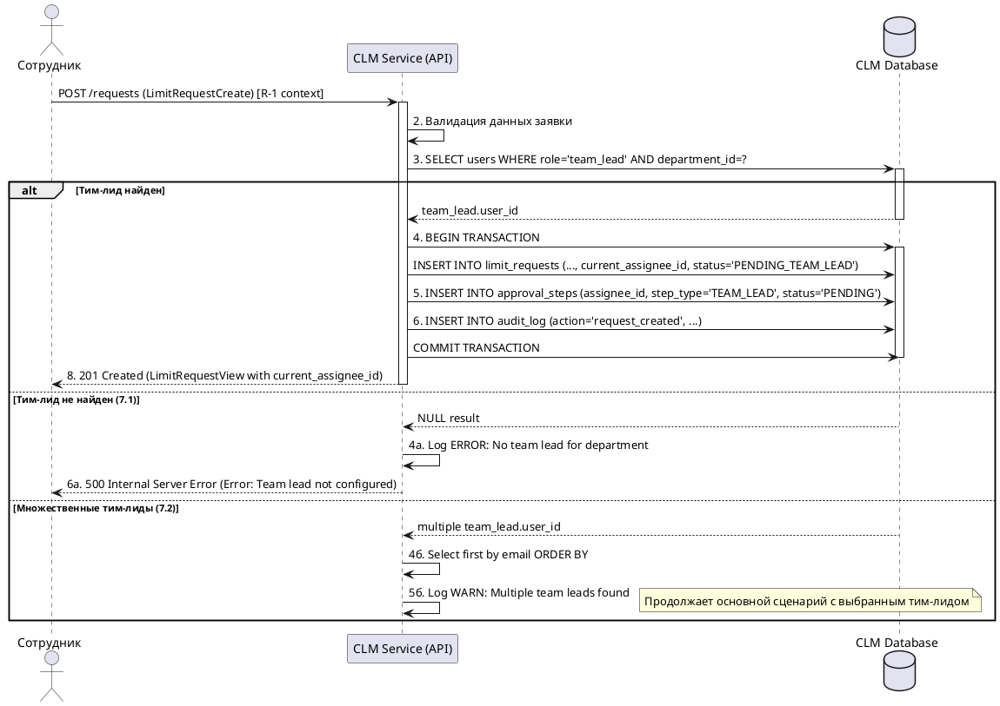

# Спецификация: R-2 Автоматическое назначение тим-лида

## 1. Обзор

Данный документ описывает процесс автоматического назначения тим-лида как первого согласующего при создании новой заявки на изменение лимита карты. Функция обеспечивает бесшовную интеграцию с процессом создания заявки и устанавливает начальную точку workflow согласования.

## 2. Ссылка на требование

- **R-2**: Система автоматически назначает тим-лида как первого согласующего. (из `docs/requirements.md`)

## 3. Заинтересованные стороны

- **Система**: Платформа Card Limit Manager.
- **Сотрудник**: Инициатор заявки (косвенно).
- **Тим-лид**: Назначаемый согласующий.

## 4. Предусловия

- Заявка находится в процессе создания (выполняется R-1).
- В системе существует пользователь с ролью `team_lead`.
- Система имеет доступ к информации об организационной структуре для определения тим-лида сотрудника.
- Сотрудник аутентифицирован и имеет роль `employee`.

## 5. Постусловия

- **Успех**:
  - Заявке назначен тим-лид в качестве текущего согласующего.
  - Статус заявки установлен в `PENDING_TEAM_LEAD`.
  - Поле `current_assignee_id` в таблице `limit_requests` содержит ID тим-лида.
  - Создана запись в таблице `approval_steps` с типом `TEAM_LEAD` и статусом `PENDING`.
  - Данные о назначении зафиксированы в audit log.
- **Неудача**:
  - Заявка не создана из-за невозможности определить тим-лида.
  - Система возвращает ошибку 500 с описанием проблемы.

## 6. Основной сценарий (Happy Path)

| #   | Actor   | Действие                                                              | Система                                                                                                                                                      | Данные                                                                                               | Схема/Контракт (CLM.json)                      |
| --- | ------- | --------------------------------------------------------------------- | ------------------------------------------------------------------------------------------------------------------------------------------------------------ | ---------------------------------------------------------------------------------------------------- | ---------------------------------------------- |
| 1   | Система | Получает запрос на создание заявки от сотрудника.                     | -                                                                                                                                                            | `LimitRequestCreate`, `user_id` из JWT                                                               | `#/components/schemas/LimitRequestCreate`      |
| 2   | Система | Валидирует данные заявки.                                             | -                                                                                                                                                            | `LimitRequestCreate`                                                                                 | `#/components/schemas/LimitRequestCreate`      |
| 3   | Система | Определяет тим-лида для сотрудника.                                   | Выполняет запрос к таблице `users` для поиска пользователя с ролью `team_lead` и соответствующим `department_id`.                                           | `employee.department_id`, `team_lead.user_id`                                                        | Таблица `users` (см. `database.dbml`)          |
| 4   | Система | Создает новую запись заявки в БД с назначенным тим-лидом.             | INSERT в `limit_requests` с `current_assignee_id` = ID тим-лида, `status` = `PENDING_TEAM_LEAD`.                                                             | `LimitRequestBase` + `id`, `user_id`, `current_assignee_id`, `status`, `created_at`, `updated_at`    | Таблица `limit_requests` (см. `database.dbml`) |
| 5   | Система | Создает первый шаг согласования.                                      | INSERT в `approval_steps` с `assignee_id` = ID тим-лида, `step_type` = `TEAM_LEAD`, `status` = `PENDING`.                                                   | `approval_step_id`, `request_id`, `assignee_id`, `step_type`, `status`, `assigned_at`               | Таблица `approval_steps` (см. `database.dbml`) |
| 6   | Система | Записывает действие в audit log.                                      | INSERT в `audit_log` с `action` = `request_created`, `actor` = ID сотрудника, `payload_json` содержит детали назначения.                                     | `audit_id`, `request_id`, `action`, `actor`, `timestamp`, `payload_json`                            | Таблица `audit_log` (см. `database.dbml`)      |
| 7   | Система | Формирует ответ с созданной заявкой.                                  | -                                                                                                                                                            | `LimitRequestView` включая `current_assignee_id`                                                     | `#/components/schemas/LimitRequestView`        |
| 8   | Система | Отправляет ответ сотруднику (HTTP 201 Created).                       | -                                                                                                                                                            | `LimitRequestView`                                                                                   | `#/components/schemas/LimitRequestView`        |

## 7. Альтернативные сценарии

### 7.1. Тим-лид не найден для департамента сотрудника

| #   | Actor   | Действие                                                              | Система                                                                                                                                                      | Данные                                                                                               | Схема/Контракт (CLM.json)                      |
| --- | ------- | --------------------------------------------------------------------- | ------------------------------------------------------------------------------------------------------------------------------------------------------------ | ---------------------------------------------------------------------------------------------------- | ---------------------------------------------- |
| 3а  | Система | Не находит пользователя с ролью `team_lead` для `department_id` сотрудника. | -                                                                                                                                                            | `employee.department_id`, результат поиска = NULL                                                    | -                                              |
| 4а  | Система | Логирует ошибку конфигурации системы.                                 | Записывает ERROR-уровень лог о отсутствии тим-лида для департамента.                                                                                         | `department_id`, сообщение об ошибке                                                                 | -                                              |
| 5а  | Система | Формирует ответ об ошибке сервера.                                    | -                                                                                                                                                            | `Error` (код 500, сообщение "Team lead not configured for department")                              | `#/components/schemas/Error`                   |
| 6а  | Система | Отправляет ответ сотруднику (HTTP 500 Internal Server Error).         | Отображает сообщение о технической ошибке с рекомендацией обратиться к администратору.                                                                      | `Error`                                                                                              | `#/components/schemas/Error`                   |

### 7.2. Множественные тим-лиды для одного департамента

| #   | Actor   | Действие                                                              | Система                                                                                                                                                      | Данные                                                                                               | Схема/Контракт (CLM.json)                      |
| --- | ------- | --------------------------------------------------------------------- | ------------------------------------------------------------------------------------------------------------------------------------------------------------ | ---------------------------------------------------------------------------------------------------- | ---------------------------------------------- |
| 3б  | Система | Находит несколько пользователей с ролью `team_lead` для `department_id` сотрудника. | -                                                                                                                                                            | `employee.department_id`, массив `team_lead.user_id`                                                 | -                                              |
| 4б  | Система | Выбирает первого тим-лида по алфавитному порядку `email`.             | Применяет детерминированную логику выбора для обеспечения консистентности.                                                                                   | Отсортированный список тим-лидов, выбранный `team_lead.user_id`                                      | -                                              |
| 5б  | Система | Логирует предупреждение о множественных тим-лидах.                    | Записывает WARN-уровень лог с информацией о найденных тим-лидах и выбранном.                                                                                | `department_id`, список `user_id`, выбранный `user_id`                                              | -                                              |
| 6б  | Система | Продолжает с выбранным тим-лидом (возврат к основному сценарию).      | Выполняет шаги 4-8 основного сценария.                                                                                                                      | -                                                                                                    | -                                              |

## 8. Поля данных

### Входные данные (из предыдущего шага R-1):
- `user_id` (string, format: uuid, required): ID сотрудника из JWT токена.
- `department_id` (string, format: uuid, required): ID департамента сотрудника из таблицы `users`.

### Выходные данные (дополнения к заявке):
- `current_assignee_id` (string, format: uuid, required): ID назначенного тим-лида.
- `status` (enum, required): Статус заявки, установленный в `PENDING_TEAM_LEAD`.

### Данные таблицы approval_steps:
- `assignee_id` (string, format: uuid, required): ID тим-лида.
- `step_type` (enum, required): Тип шага согласования `TEAM_LEAD`.
- `status` (enum, required): Статус шага `PENDING`.
- `assigned_at` (string, format: date-time, required): Временная метка назначения.

## 9. Критерии приемки

- Система корректно определяет тим-лида для департамента сотрудника на основе организационной структуры.
- При создании заявки автоматически устанавливается статус `PENDING_TEAM_LEAD` и назначается соответствующий тим-лид.
- Создается запись в таблице `approval_steps` с корректными данными о первом шаге согласования.
- При отсутствии тим-лида для департамента система возвращает ошибку 500 с понятным сообщением.
- При наличии нескольких тим-лидов система детерминированно выбирает одного по установленному алгоритму.
- Все действия по назначению фиксируются в audit log согласно требованию R-10.
- Поле `current_assignee_id` в ответе API корректно отражает назначенного тим-лида.

## 10. Диаграмма последовательности (PlantUML)

## 11. Дополнительные замечания

- Логика назначения тим-лида тесно интегрирована с процессом создания заявки (R-1) и должна выполняться в рамках одной транзакции.
- Предполагается, что организационная структура (связь сотрудник-департамент-тим-лид) поддерживается через таблицу `users` с полями `department_id` и `role`.
- В случае реорганизации департаментов система должна обеспечивать корректное назначение, поэтому рекомендуется периодический аудит настроек тим-лидов.
- Алгоритм выбора при множественных тим-лидах (по алфавитному порядку email) обеспечивает детерминированность и может быть изменен в будущем на более сложную логику балансировки нагрузки.